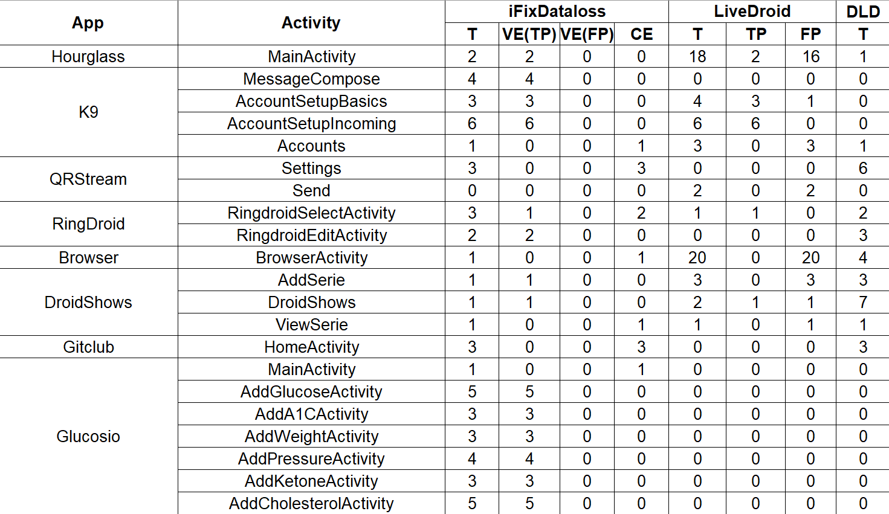
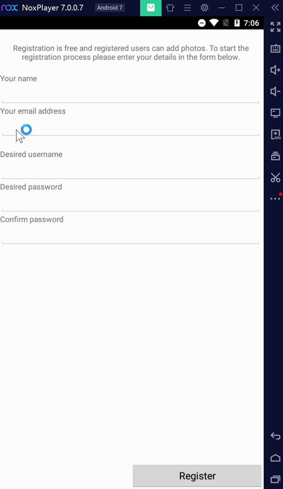
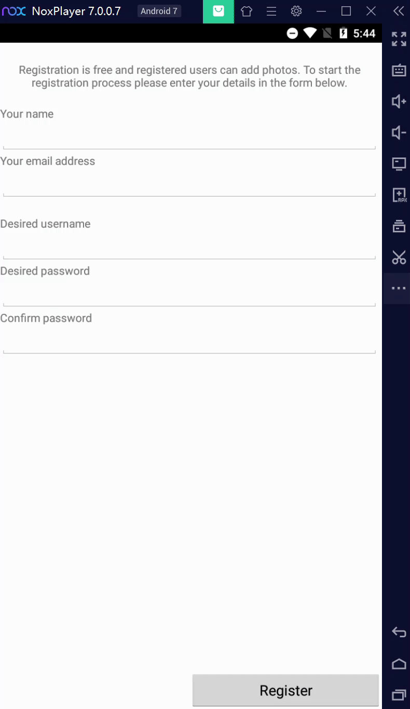

[](https://doi.org/10.5281/zenodo.6540706)
# iFixDataloss
This repository contains the iFixDataloss tool, the evaluation detail and all data loss issues detected by iFixDataloss, which are available in three separate folders: tool and source code, evaluation, and DataSet.

Specifically, the comparisions between iFixDataloss and the other two data loss detection tools(LiveDroid and DLD) for each app's activities are in the Results.xlsx which is in the evaluation folder. The picture below shows partial results.
<p align="left"></div>

All data loss issues detected by iFixDataloss are in the DataSet folder, and the output of LiveDroid and DLD are in the results folder of evaluation.

We give two examples to show the data loss issue.

## Example1
<table><tr>
<td>
<div>

<h1 align="center">before fixing</h1>
</div>
</td>
<td>
<div>

<h1 align="center">after fixing</h1>
</div>
</td>
</tr></table>

## Example2
<table><tr>
<td>
<div>

<h1 align="center">before fixing</h1>
</div>
</td>
<td>
<div>

<h1 align="center">after fixing</h1>
</div>
</td>
</tr></table>

## How to use the tool

#### OverView
- ``/AndroidStaticAnalysis`` contains the source code for static analyzer.
- ``/DynamicExplore`` contains the source code for dynamic explorer. 
- ``/AndroidPatchGen`` contains the source code for patch generator.

#### Prerequisites
- JDK installation and should be on path.
- Android SDK installation, and set ``$ANDROID_HOME``  to Android SDK.
- adb should be on path.
- MYSQL installation.
- Intellij IDEA and AndroidStudio installation(or install Maven and Gradle and set them on path).
- Android device(or emulator) connected to PC

#### Initialize MYSQL Database
- Create android database: mysql CREATE DATABASE android;
- Initailize database: mysql -u**username** -p**password** -Dandroid < ../AndroidStaticAnalysis/androidmodel.sql Please replace **username** and **password** with your own.

#### Configure

1. Configure the ``config.properties`` under /AndroidStaticAnalysis/src/main/resources, which looks like as:

   ```bash
   DRIVER=com.mysql.jdbc.Driver
   MYSQLURL=jdbc:mysql://127.0.0.1:3306/android?useUnicode=true&characterEncoding=UTF-8&useSSL=false
   MYSQLUSERNAME=root
   MYSQLPASSWORD=1234
   INPUTAPKPATH=inputApk
   ```

   The MYSQLURL, MYSQLUSERNAME, MYSQLPASSWORD are the url, username, password of MYSQL, please replace them with the arguments of your own. Other values remain default, and the input apk(arXiv mobile.apk) is in the INPUTAPKPATH(AndroidStaticAnalysis/inputApk).

2. Configure the ``Aconfig.properties`` under /DynamicExplore/app/src/main/assets, which looks like as:

   ```bash
   MYSQLDRIVER=com.mysql.jdbc.Driver
   MYSQLURL=jdbc:mysql://192.168.1.102:3306/android?useUnicode=true&characterEncoding=UTF-8&useSSL=false
   MYSQLUSERNAME=root
   MYSQLPASSWORD=1234
   SQLITEDRIVER=org.sqldroid.SQLDroidDriver
   SQLITEDBPATH=/storage/emulated/0/navgraph.db
   WINLABEL=arXiv mobile
   TESTTIMEOUT=300000
   ```

   Similar to the above, please replace MYSQLURL, MYSQLUSERNAME, and MYSQLPASSWORD with the arguments of your own. It is worth noting that the ip address of MYSQLURL should be the ip address of your PC(e.g. 192.168.1.102) not 127.0.0.1. Other values remain default.

3. Configure the ``Pconfig.properties`` under /AndroidPatchGen/src/main/resources, which looks like as:

   ```bash
   GRAPHLABEL=arXiv mobile
   SRCPATH=PatchedProject/arxiv-mobile/src
   SQLITEDRIVER=org.sqlite.JDBC
   SQLITEDBPATH=db/navgraph.db
   ```

   All values remain default.

#### Compile

1) Compile AndroidStaticAnalysis: Intellij IDEA compile or maven compile
   - Intellij IDEA compile: import this module using Intellij IDEA and compile it.
   - Maven compile: 
     - cd .../AndroidStaticAnalysis 
     - mvn compile
2) Compile DynamicExplore: AndroidStudio compile or gradle compile

   - AndroidStudio compile: import this module using AndroidStudio and compile it.
   - Gradle compile:
     - cd .../DynamicExplore
	  - gradlew clean
     - gradlew build  
     - gradlew assembleDebug
	  - gradlew assembleDebugAndroidTest

   If succeed, two apk files(debug apk and test apk) should be at DynamicExplore/app/build/outputs/apk/debug/app-debug.apk and DynamicExplore/app/build/outputs/apk/androidTest/debug/app-debug-androidTest.apk
3) Compile AndroidPatchGen: similar to compiling AndroidStaticAnalysis.

#### Quick Run
After compiling AndroidPatchGen, run the main method of com.fdu.se.patchgen.Main class in Intellij IDEA, or **cd .../AndroidPatchGen** and **mvn exec:java -Dexec.mainClass="com.fdu.se.patchgen.Main"**
If the execution succeed, the patched activity and its code will be printed.

#### Run static analyzer
Run the main method of com.fdu.se.sootanalyze.Main class in Intellij IDEA, or **cd .../AndroidStaticAnalysis** and **mvn exec:java -Dexec.mainClass="com.fdu.se.sootanalyze.Main"**
If the execution succeed, the static model will stored in your MYSQL database.
#### Run dynamic explorer
- Install the debug apk(DynamicExplore/app/build/outputs/apk/debug/app-debug.apk) and start it.
- Install the input apk(adb install ../AndroidStaticAnalysis/inputApk/arXiv mobile.apk) and start it. 
- Install the test apk: adb install -r ../DynamicExplore/app/build/outputs/apk/androidTest/debug/app-debug-androidTest.apk
- Run the dynamic explore process: adb shell am instrument -w -r -e debug false -e class 'com.fdu.uiautomatortest.DynamicTest#detectDataloss' com.fdu.uiautomatortest.test/android.support.test.runner.AndroidJUnitRunner
- adb install -t C:\iFixDataloss\DynamicExplore\app\build\outputs\apk\debug\app-debug.apk
- adb install -r C:\iFixDataloss\DynamicExplore\app\build\outputs\apk\androidTest\debug\app-debug-androidTest.apk
If all the steps succeed, a db file should be at /storage/emulated/0/navgraph.db of your android device(or emulator).
#### Run patch generator
- Move the navgraph.db from your android device to PC: adb pull /storage/emulate/0/navgraph.db ../AndroidPatchGen/db
- cd .../AndroidPatchGen
- mvn exec:java -Dexec.mainClass="com.fdu.se.patchgen.Main
